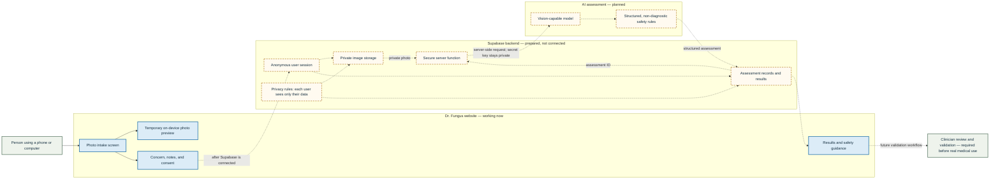

# Dr. Fungus — Project Setup and System Map

Last updated: September 20, 2026

## What the project is

Dr. Fungus is a mobile-friendly web prototype for collecting a photo of a toenail or foot concern, a short description, and the user's consent. The long-term goal is to return a careful, AI-assisted photo assessment that helps the user decide what to do next.

The product must not present its output as a confirmed medical diagnosis. A production version would require clinical validation, privacy controls, professional review, and regulatory guidance.

## Current status

### Working today

- A responsive React website with a warm, editorial healthcare design.
- Photo selection by tapping, browsing, or dragging and dropping.
- Local photo preview, file-type validation, and a 12 MB size limit.
- A short concern form, optional notes, and an informed-consent checkbox.
- Clear urgent-care guidance for potentially serious symptoms.
- A simulated assessment card with a possible match, alternative explanations,
  follow-up timing, suggested next steps, and an explicit prototype warning.
- A second Therapies page with searchable foot-care categories and external
  retailer links. Dr. Fungus does not currently process purchases or checkout.
- A prototype professional network: simulated subscribed-provider results appear
  after a photo assessment, plus a clinician profile and membership preview.
- Passwordless patient and professional account screens that use Supabase email
  magic links when environment credentials are present.
- A generated editorial hero image and custom favicon.
- A production build command that completes successfully.
- Source code committed and pushed to the GitHub `main` branch.
- A private OpenAI Sites project has been registered, but no version has been published yet.

### Prepared in code, but not connected yet

- A Supabase client adapter.
- Anonymous Supabase sessions, so a prototype user would not need a signup screen.
- A private storage path organized by user and assessment.
- A database migration for assessment records, row-level security, and a private image bucket.
- A clearly isolated simulation layer that can later be replaced by a validated AI service.

### Not active yet

- The Supabase project URL and public/anonymous key have not been added to the local environment.
- The Supabase SQL migration has not been applied to the hosted Supabase project.
- Anonymous sign-in has not been confirmed as enabled in Supabase.
- No image is currently uploaded or saved when someone uses the prototype.
- No AI or vision model receives the photo.
- No AI result is stored in the database.
- The site has not been deployed to a public or private production URL.

## What happens to a photo right now

1. The user selects a photo.
2. The browser creates a temporary preview on that device.
3. The photo is not uploaded, saved, inspected, or sent to an AI model.
4. After submission, the app selects prewritten educational content using only the
   concern category chosen in the form. The result is prominently labeled as simulated.
5. Removing the photo, refreshing the page, or closing the page clears the temporary preview.

This behavior is intentional while the backend is unconfigured.

## Major system components

The diagram distinguishes what works now from what is planned. Solid blue components exist in the current prototype. Dashed components are prepared or proposed but still need credentials, configuration, deployment, or validation.



## Plain-English explanation of the diagram

- **The website** is the part people see and use. It collects the photo and context.
- **Supabase Authentication** gives each prototype user a private identity without requiring a traditional signup form.
- **Supabase Storage** would hold the original photo in a private bucket.
- **The Supabase database** would hold the concern, notes, processing status, and eventual structured result.
- **Row-level security** is the privacy gate that prevents one user from reading another user's records.
- **A secure server function** would retrieve the private photo and call the AI. This is necessary because secret API keys must never be placed in browser code.
- **The vision model** would examine visible features and return a constrained informational assessment—not a definitive diagnosis.
- **Safety rules** would require uncertainty, image-quality checks, urgent-warning detection, and clear next steps.
- **Clinical review** is separate from the software. It is needed to determine whether the system is accurate and safe enough for real medical use.

## Repository structure

```text
Dr Fungus/
├── src/
│   ├── App.tsx                 Main intake interface and user flow
│   ├── styles.css              Responsive visual design
│   └── lib/
│       ├── storage.ts          Supabase upload and record adapter
│       └── diagnostics.ts      Simulated results and future AI boundary
├── public/
│   ├── foot-care-editorial.png Hero photograph
│   └── favicon.svg             Site icon
├── supabase/
│   └── migrations/
│       ├── 001_create_assessments.sql
│       │                          Assessments, security policies, and image bucket
│       └── 002_accounts_and_professionals.sql
│                                  Account roles and professional network data
├── .env.example               Required public Supabase settings
├── .openai/hosting.json       OpenAI Sites registration and build-output setting
├── package.json               App dependencies and commands
└── README.md                  Short developer introduction
```

## Technology choices

| Layer | Current choice | Purpose |
| --- | --- | --- |
| User interface | React + TypeScript | Builds the photo intake and results experience |
| Build tool | Vite | Runs the app locally and creates the production files |
| Icons | Lucide React | Provides accessible interface icons |
| Backend plan | Supabase | Authentication, database, private image storage, and server functions |
| AI plan | Vision-capable model called from a server function | Reviews the image without exposing an API key to the browser |
| Source control | GitHub | Stores the code and its change history |
| Hosting registration | OpenAI Sites | A private site project exists but is not yet deployed |

## Local development

Requirements: Node.js and npm.

```bash
npm install
npm run dev
```

The local development site is normally available at `http://localhost:5173`.

To create a production build:

```bash
npm run build
```

## Supabase connection steps still required

1. Add the project URL and public/anonymous client key to `.env.local`:

   ```text
   VITE_SUPABASE_URL=https://PROJECT-ID.supabase.co
   VITE_SUPABASE_ANON_KEY=PUBLIC-CLIENT-KEY
   ```

2. Apply `supabase/migrations/001_create_assessments.sql` to the Supabase project.
3. Enable anonymous sign-ins for the prototype.
4. Confirm that the `foot-assessments` bucket is private.
5. Test that one anonymous user cannot read another user's rows or files.

The public/anonymous Supabase key is designed for browser use. Database privacy must still be enforced by row-level security. A Supabase service-role key must never be placed in this website or committed to GitHub.

## AI prototype steps still required

1. Add a server-side function that accepts an assessment ID rather than a raw public image URL.
2. Verify the caller owns that assessment.
3. Retrieve the photo from private storage.
4. Call a vision-capable model with a server-only API key.
5. Require a structured response containing:
   - image quality;
   - visible features;
   - a small number of possible patterns with uncertainty;
   - urgency level and red flags;
   - follow-up questions;
   - non-prescriptive next steps; and
   - an explicit non-diagnostic disclaimer.
6. Store the structured result and display it in the existing results area.
7. Add a failure state that preserves the submitted record and allows a safe retry.

## Safety and privacy requirements before real use

- Do not market prototype output as a diagnosis.
- Do not prescribe medication or doses from a photo-only assessment.
- Require the model to abstain when the image is blurry, obscured, unrelated, or inconclusive.
- Escalate severe pain, spreading redness, fever, pus, open wounds, blackened tissue, loss of feeling, diabetes-related wounds, and circulation concerns.
- Define photo-retention and deletion rules.
- Avoid logging photos, signed URLs, medical notes, or secret keys.
- Obtain appropriate privacy, security, legal, and regulatory review.
- Evaluate the system on representative, clinician-reviewed images before involving real patients.
- Keep a human review path for uncertain, urgent, and high-risk cases.

## Recommended next milestone

Connect Supabase first and verify that private uploads work end to end without involving AI. After storage and access controls are proven, add the server-side vision call and test only with consented, non-sensitive prototype images. This keeps infrastructure problems separate from model-quality and medical-safety problems.
